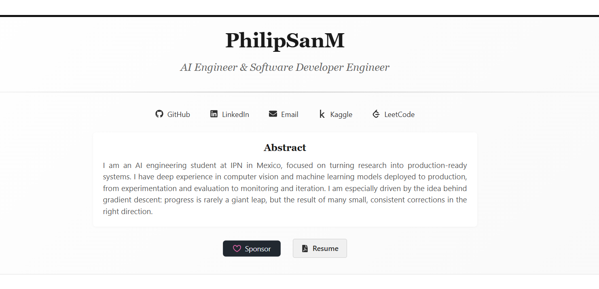

# philipsanm.github.io

Hi, this is my GitHub Page portfolio.

The design is inspired by a research-paper style layout. If you think it could be useful, feel free to clone it and adapt it.

## Developer environment

Install:

- Node.js
- npm

Setup:

1. Clone this repository.
2. Run `npm ci`.
3. Run `npm run dev`.

## Tech stack and tools

- React 19
- TypeScript
- Vite
- Less
- D3 (for chart components)
- ESLint

## Available scripts

- `npm run dev`: starts local dev server.
- `npm run build`: creates production build.
- `npm run preview`: previews production build locally.
- `npm run lint`: runs lint checks.

## Project structure

- `src/components`: reusable UI components.
- `src/data`: portfolio content and chart data.
- `src/styles`: Less styles by section/component.
- `src/assets`: images and static media used by the site.
- `public`: public static files.

## Build

Run `npm run build` to create a production build.

## Deploy notes

This site is intended for GitHub Pages deployment. Build output is generated in `dist`.

If you use GitHub Actions for deploy, push to your main branch and make sure GitHub Pages is configured to use Actions as the source.
